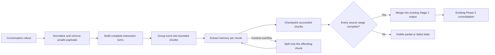

# Reliable Memory Extraction for Oversized Codex Conversations

Codex can learn from previous conversations through a background memory pipeline. Long conversations are the most likely to contain durable decisions, corrections, and verified solutions. They are also the easiest to lose when one extraction request exceeds the model's input budget.

This field note documents a local reference implementation for processing oversized conversations without silently losing coverage.

It is independent work by [Artem Getman](https://github.com/artemgetmann). It is not an OpenAI patch, an accepted Codex contribution, or a production benchmark.

## The problem

[Issue #38860](https://github.com/openai/codex/issues/38860) reports that Stage 1 memory extraction exhausted its retries for 93 sessions after context window failures. Those sessions produced no Stage 1 memory output, and the missing coverage was not visible to the user.

The reviewed upstream snapshot added a mitigation. At [commit `312b62ac9`](https://github.com/openai/codex/blob/312b62ac95335e1762b70ceb8910374965bd2785/codex-rs/memories/write/src/prompts.rs#L90-L116), Stage 1 keeps the head and tail of the rendered conversation within 70 percent of the model's effective input window.

That reduces context window failures, but it can discard the middle. The middle may contain the user's correction, the actual root cause, or the test that proved the fix.

## The design in plain language

Treat a long conversation like a sequence of complete work units.

A work unit contains:

1. The user request.
2. The agent's work and relevant tool results.
3. The final outcome.

Keep each unit together whenever possible. Group complete units into bounded chunks. Extract memory from every chunk. Save each successful result. If one chunk is still too large, split only that chunk. Never resend the same oversized payload unchanged.

Report full success only when every source range was processed. If coverage is incomplete, make that state visible and keep it out of final consolidation.

## Architecture

## What the prototype implements

- Bounded chunks of complete interaction turns.
- A source budget of the smaller of 48,000 estimated tokens or 40 percent of the model's effective input window.
- One previous turn carried as context only when it fits.
- Semantic splitting for oversized messages, calls, and tool output.
- Local receipts for removed binary, media, encrypted, repeated, or omitted content.
- Durable chunk checkpoints keyed by source identity and digest.
- Adaptive splitting after context overflow.
- Lease renewal while model requests are running.
- A limit of 64 model requests and 64 planned leaf chunks per rollout.
- Complete only admission into the existing Phase 2 path.
- Visible complete, partial, and failed coverage states.

## Evidence

The local branch contains six focused commits based on upstream commit `312b62ac95335e1762b70ceb8910374965bd2785`.

All 418 targeted tests passed:

| Crate | Result |
| --- | ---: |
| `codex-memories-write` | 59 of 59 |
| `codex-state` | 187 of 187 |
| `codex-api` | 172 of 172 |

One synthetic end to end case used a 200,000 byte conversation with a correction in the middle. It produced two bounded Stage 1 requests. The second request retained the correction and marked the previous turn as context only. Both outputs reached the existing Phase 2 input path.

See [TEST_EVIDENCE.md](TEST_EVIDENCE.md) for the test matrix and proof limits.

## What this does not prove

- No real conversation or real user memory database was used.
- Model responses were mocked.
- Token counts use Codex's byte based estimate, not the selected model's exact tokenizer.
- The work does not measure production cost, latency, throughput, or model quality.
- It does not prove installed Codex desktop behavior.
- It does not implement semantic deduplication, contradiction resolution, confidence scoring, or long term memory ranking.

This is a tested reliability design. It is not a production readiness claim.

## Reference implementation status

The implementation remains local. The [Codex contribution policy](https://github.com/openai/codex/blob/main/docs/contributing.md) does not accept external code contributions or pull requests, so this repository presents the problem, design, and test evidence instead of pretending to be an upstream patch.

The six commit structure and changed path map are documented in [REFERENCE_IMPLEMENTATION.md](REFERENCE_IMPLEMENTATION.md). Sanitized patches can be prepared if a Codex maintainer asks to inspect them.

## Public discussion

- [Original issue #38860](https://github.com/openai/codex/issues/38860)
- [Published design and test comment](https://github.com/openai/codex/issues/38860#issuecomment-5365441023)
- [Technical design](TECHNICAL_DESIGN.md)
- [Attribution and reuse](ATTRIBUTION.md)

