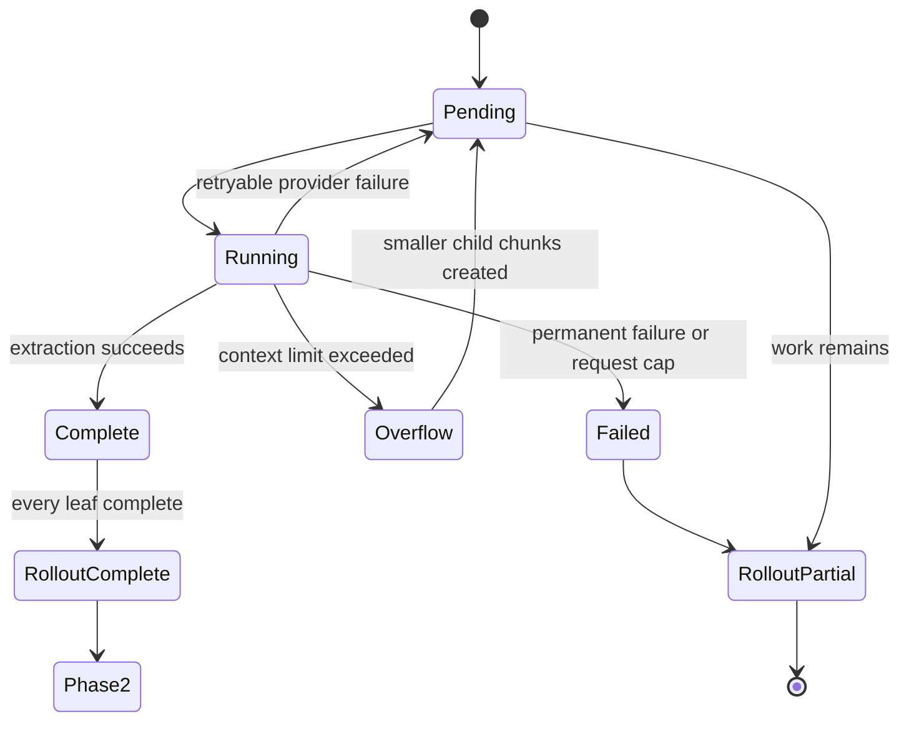

# Technical Design

## Scope

This design fixes lost coverage and silent failure when one Stage 1 memory extraction input is too large.

It preserves the existing Stage 1 output fields and the existing Phase 2 consolidation boundary. It does not attempt to solve memory quality, semantic deduplication, contradiction resolution, retrieval ranking, or memory decay.

## What a chunk is

A chunk is a bounded group of complete conversation turns sent to one Stage 1 extraction request.

A turn is a complete interaction unit:

```text
User request
  -> agent actions
  -> relevant tool calls and results
  -> user facing result
```

Arbitrary character slices are unsafe. They can separate a tool call from its result, preserve a failure while dropping the later success, or keep an old fact while losing the user's correction.

## Budget

The prototype uses this source budget:

```text
min(48,000 estimated tokens, 40% of the model's effective input window)
```

The final rendered request is checked again before submission. Codex's current shared estimator uses approximately four UTF 8 bytes per token. The prototype does not claim tokenizer exact accounting.

## Boundaries and carry forward context

Complete turns stay together when they fit.

The previous chunk's final turn is repeated as `context_only` when it fits. This helps resolve references such as “change that to two retries.” Context only turns are not treated as new source evidence.

If the repeated turn is oversized, the planner carries a deterministic record of its request, outcome, and source identifiers instead of duplicating the full payload.

## Oversized individual items

A single turn can exceed the source budget. The prototype then splits at semantic boundaries:

- messages by text boundaries;
- function and custom tool calls by their text fields;
- structured shell, tool search, and web search data by serialized records;
- large output by lines or structured items.

Binary and base64 content becomes a local receipt. Exact repetition is collapsed. Relevant errors, exit status, verification lines, and omission metadata remain available to extraction.

Encrypted function arguments are removed before model submission. Media URLs are reduced to safe metadata so signed query parameters are not copied into the prompt.

## Chunk lifecycle



Every chunk has:

- a stable path;
- source turn identifiers;
- a source digest;
- an optional parent path;
- status and failure data;
- output only after successful extraction.

Completed chunks are reused after restart when their path and digest still match. Recomputed overflow children replace stale descendants so obsolete rows cannot block or inflate coverage.

## Retry behavior

Retryable provider failures use bounded backoff for the same chunk.

Context overflow follows a different path:

1. Classify the failure as context overflow.
2. Mark the parent as overflow under the current ownership token.
3. Reduce the source budget.
4. Create smaller child chunks.
5. Process the children without resending the parent payload.

The prototype allows at most three provider retries per chunk. It limits one rollout invocation to 64 model requests and 64 planned leaf chunks. Exceeding the cap creates a failed coverage receipt instead of silently treating the retained prefix as complete.

## Persistence and ownership

Chunk plans and outputs are stored in the Codex state database. Writes are fenced by thread identity, source update time, source digest, and the active ownership token.

The runner renews its lease while model streams are active. This prevents a second startup from reclaiming the same job and resending private chunks while the original request is still running.

## Aggregation

Every complete chunk returns the existing Stage 1 output shape:

```text
raw_memory
rollout_summary
rollout_slug
```

The prototype merges complete chunk outputs deterministically into the same rollout level fields. Phase 2 remains unchanged.

This merge preserves chunk outputs but does not perform semantic candidate deduplication or contradiction resolution. Those are separate memory quality problems.

A private three-rollout live comparison tested this exact boundary. Raw deterministic merging matched
the current head and tail baseline on the 28 predeclared facts, but produced 3.56 times more text and
preserved obsolete intermediate states. The merged Stage 1 output should therefore be treated as
complete input for consolidation, not as a useful final memory by itself. The experiment did not run
Phase 2 because the candidate missed its predeclared Stage 1 quality gate.

## Coverage contract

Phase 2 receives a rollout only when every leaf chunk is complete.

Coverage is one of:

- `complete`: every source leaf succeeded;
- `partial`: some source work succeeded, but at least one range is pending, overflowed, omitted, or failed;
- `failed`: no usable complete coverage exists.

The central invariant is straightforward:

```text
No missing source range can be reported as full success.
```
